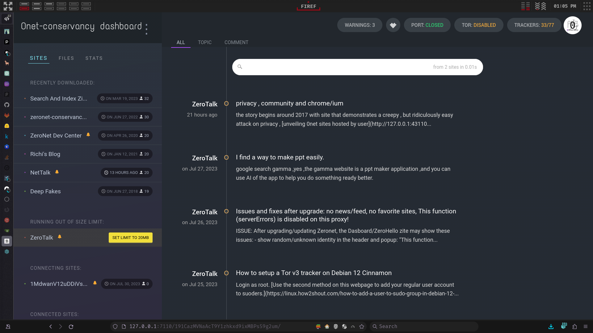
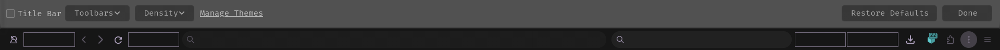
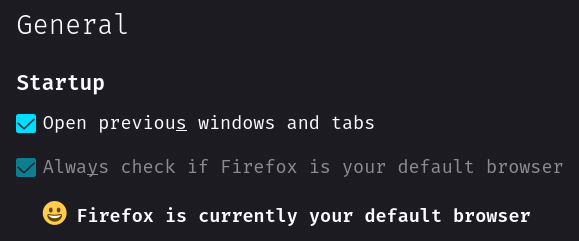
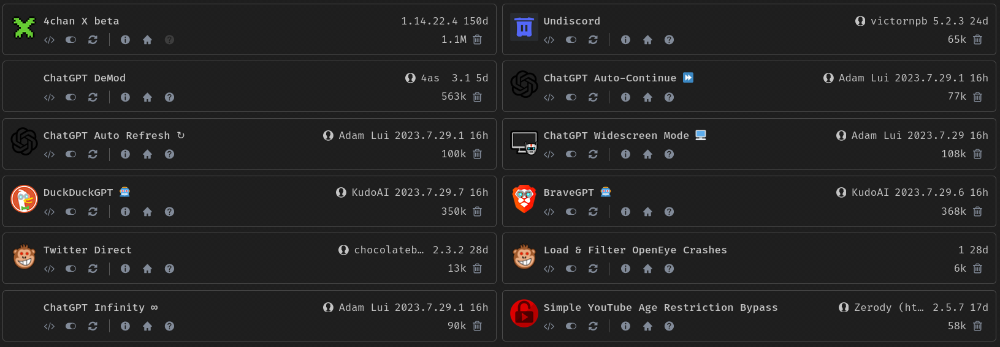

## About
My Tailor-Fitted highly customized and advanced [Firefox](https://www.mozilla.org/en-US/firefox) configuration.

> [!NOTE]
> This repository is not meant to be used as a whole but rather as a reference for my own configuration. I do not recommend using it as is, as it is not meant to be used by anyone else. I do not provide any support for this repository. If you want to use it, you are on your own.
>
> For other experimental features, check out the other branches of this repository.

> [!IMPORTANT]
> Firefox occasionally changes its codebase, which may break some of the configurations on newer versions of Firefox. I try to keep this repository updated, but I cannot guarantee that everything will work as expected. To deal with it yourself, refer to the [Customizing Firefox](#customizing-firefox) section.

> [!TIP]
> Customizing Firefox: For detailed guidance on customizing Firefox to suit your needs, refer to the [Customizing Firefox](#customizing-firefox) section. _TL;DR_: To find and inspect browser's selectors see: [Browser Toolbox](https://developer.mozilla.org/en-US/docs/Tools/Browser_Toolbox).
>
> Disable Telemetry and Data Collection: Ensure that all telemetry and data collection features are turned off in Firefox. You can use my `user.js` as a reference, and explore other `user.js` files and hardened Firefox configurations for additional security.
>
> Cookie Management: With cookie isolation enabled, clearing cookies may be less effective. Instead, consider using temporary containers for better privacy.
>
> JPEG XL (JXL): Firefox 128 now supports JPEG XL images. You can use the [JPEG XL](https://jpeg.org/jpegxl/) format for images to save bandwidth and improve loading times. It is available as `image.jxl.enabled` in `about:config` preference. You can enable it by setting it to `true`. Note that it is currently an experimental feature in Firefox 128+.

I recommend using a Firefox account and sync everything. Make sure to disable telemetry (all telemetry actually) in the settings ;)

## Where do each files go
| File      | Location    |
| ----------| ----------- |
| user.js   | ~/.mozilla/firefox/<path_ID>.default/ |
| chrome    | ~/.mozilla/firefox/<path_ID>.default/ |

NB: You can find your default profile in `~/.mozilla/firefox/profiles.ini`.

## Additional tweaks
### Toolbar
Go to `Open application menu > More tools > Customize toolbar...` and make the following changes:

### General

## Addons
You can find list of addons I use [here](https://addons.mozilla.org/en-US/firefox/collections/17970682/TAT-Collection/).

## Userscripts

## Theme
The theme I'm currently using: [Dark Theme by huhncares](https://addons.mozilla.org/en-US/firefox/addon/dark-theme-hc/)
